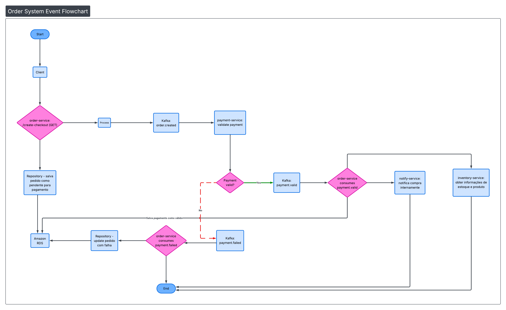

# Event-Driven Order System in Go



## Architecture Overview

This project implements an event-driven microservices architecture for order processing using Go, Kafka, and MySQL.

The system follows asynchronous communication patterns to handle order creation, payment validation, and subsequent business processes.

## Current Implementation

### Services

#### Order Service

* **Port**: 8080
* **Database**: MySQL (`orders` database)
* **Cache**: Redis
* **Responsibilities**:

  * Handles order creation through the `/create-checkout` endpoint
  * Persists orders with a `pending payment` status
  * Publishes `order.created` events to Kafka
  * Consumes payment confirmation events from Kafka

#### Payment Service

* **Port**: 8082
* **Cache**: Redis
* **Responsibilities**:

  * Consumes `order.created` events from Kafka
  * Performs payment validation
  * Publishes payment status events (`payment.confirmed` or `payment.failed`) to Kafka

## Event Flow

### 1. Order Creation

* The client sends a request to `order-service/create-checkout`
* The order is persisted in MySQL with a `pending payment` status
* An `order.created` event is published to Kafka

### 2. Payment Processing

* `payment-service` consumes the `order.created` event
* Payment validation is performed
* Based on the result:

  * On success, a `payment.confirmed` event is published
  * On failure, a `payment.failed` event is published

### 3. Order Status Update

* `order-service` consumes payment status events
* The order status is updated in MySQL
* Failed payments result in the order being marked as `failed`

## Infrastructure Components

### Message Broker

* **Kafka**: Event streaming platform used for asynchronous communication
* **Topics**:

  * `order.created`: Published when a new order is created
  * `payment.confirmed`: Published after successful payment validation
  * `payment.failed`: Published when payment validation fails

### Databases

* **MySQL**: Primary storage for order information
* **Redis**: Caching layer used to improve performance

### Development Tools

* **Kafka UI**: Web interface for managing and monitoring Kafka (Port 8081)

## Planned Improvements

### Notify Service

* **Purpose**: Internal purchase notification system
* **Trigger**: Consumes `payment.confirmed` events
* **Functionality**: Sends internal notifications for successful purchases

### Inventory Service

* **Purpose**: Integration with inventory management
* **Trigger**: Consumes `payment.confirmed` events
* **Functionality**:

  * Retrieves product and inventory information
  * Decreases inventory levels for confirmed orders
  * Communicates with an external inventory microservice

### Future Flow

After a payment is confirmed:

1. `notify-service` processes internal purchase notifications
2. `inventory-service` handles inventory reduction
3. Additional events can be published to propagate inventory updates

## Technical Specifications

### Technology Stack

* **Language**: Go
* **Web Framework**: Gin
* **Message Queue**: Apache Kafka
* **Database**: MySQL 8.0
* **Cache**: Redis 8.2
* **Containerization**: Docker & Docker Compose

### Project Structure

```text
services/
├── order-service/
│   ├── internal/
│   │   ├── domain/
│   │   ├── usecases/
│   │   ├── repository/
│   │   └── rest/
│   ├── kafka/
│   │   ├── events/
│   │   ├── producer/
│   │   └── consumer/
│   └── infra/
└── payment-service/
    ├── internal/
    │   ├── domain/
    │   ├── usecases/
    │   └── rest/
    ├── kafka/
    │   ├── events/
    │   ├── producer/
    │   └── consumer/
    └── infra/
```

## Environment Configuration

Each service uses environment variables for:

* Database connections
* Redis configuration
* Kafka broker configuration
* Service-specific parameters

## API Endpoints

### Order Service

* `GET /create-checkout`: Creates a new order checkout

### Payment Service

* No direct HTTP endpoints — the service is fully event-driven

## Development Setup

### Prerequisites

* Docker & Docker Compose
* Go 1.21+

### Running the Application

```bash
docker-compose up -d
```

This will start:

* MySQL (`3306`)
* Kafka (`9092`)
* Kafka UI (`8081`)
* Redis (`6380`)
* Order Service (`8080`)
* Payment Service (`8082`)

## Event Schemas

### Order Created

```json
{
  "event_id": "string",
  "event_type": "order.created",
  "timestamp": "datetime",
  "content_id": "int",
  "checkout": {
    "id": "int",
    "price": "float",
    "status": "string"
  }
}
```

### Payment Confirmed

```json
{
  "event_id": "string",
  "event_type": "payment.confirmed",
  "timestamp": "datetime",
  "content_id": "int",
  "order_id": "int"
}
```

### Payment Failed

```json
{
  "event_id": "string",
  "event_type": "payment.failed",
  "timestamp": "datetime",
  "content_id": "int",
  "order_id": "int"
}
```

## Monitoring & Observability

### Logging

* Structured logging with contextual information
* Event tracking using correlation IDs
* Error logging with stack traces

### Health Checks

* Database connectivity checks
* Kafka broker availability
* Redis connection validation

## Scalability Considerations

### Kafka Configuration

* Single-broker setup for development
* Configurable for multi-broker deployments in production
* Automatic topic creation enabled

### Service Scalability

* Stateless services allow horizontal scaling
* Database connection pooling
* Redis clustering for high availability
